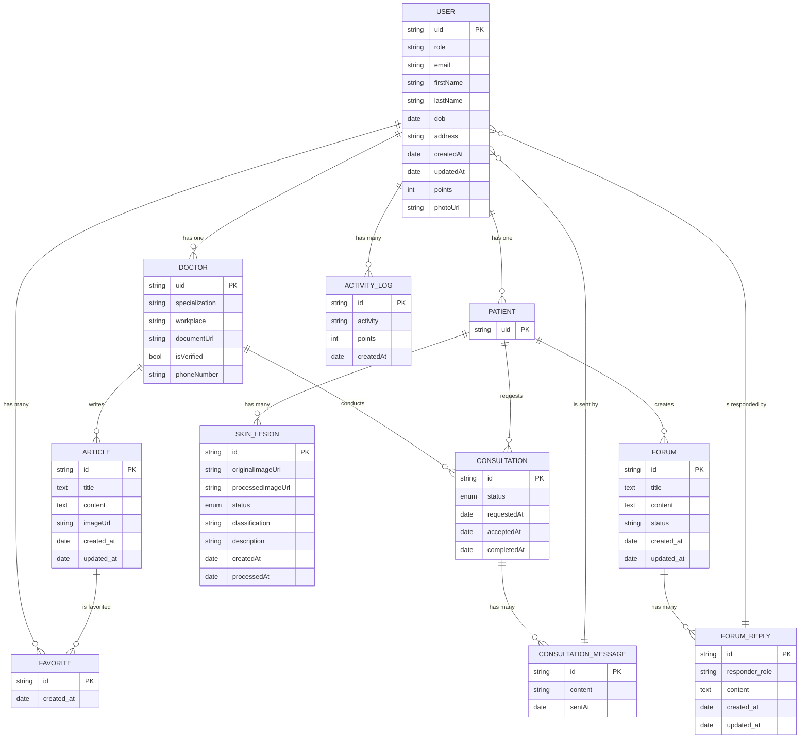

# DermaScan

# About this project

In Indonesia, many underserved communities struggle to access basic healthcare, especially for early diagnosis and treatment of skin conditions. Limited access to dermatologists and healthcare facilities makes it difficult for individuals in these areas to receive timely care, which often leads to delayed treatment and worsened health outcomes. Traditional diagnostic tools rely on large amounts of data and skilled professionals, which are often unavailable or inaccessible in these regions.

To address these challenges, an accessible and reliable digital health solution is needed to provide early detection, remote consultation, and educational health resources. By leveraging AI-driven skin lesion classification, telehealth features, and accessible information, this project seeks to empower underserved communities with a tool that can improve their health and well-being, regardless of geographic or economic limitations.

The increasing prevalence of dermatological diseases, combined with the diversity and rarity of certain skin lesions, presents a significant diagnostic challenge in dermatology. Traditional diagnostic methods struggle with accuracy, particularly when data for rare conditions is limited, which can delay proper treatment and worsen patient outcomes.

Empower your skin health journey with DermaScan! 🌟🩺 This innovative app is your personalized guide to healthy skin, providing AI-driven skin lesion classification, remote consultations with dermatologists, and valuable educational resources. Take charge of your skin health and ensure timely care and treatment, no matter where you are. 🌍✨

# Team Member - C242-PS028

|  Bangkit ID  | Name                       |   Learning Path    |                      LinkedIn Profile                       | Github                                               | Status |
| :----------: | -------------------------- | :----------------: | :---------------------------------------------------------: | ---------------------------------------------------- | :----- |
| A179B4KY2165 | Kemas Khairunsyah          | Mobile Development |  [LinkedIn](https://www.linkedin.com/in/kemaskhairunsyah/)  | [@herros27](https://github.com/herros27)             | Active |
| A284B4KY3690 | Rangga Gumilang            | Mobile Development |     [LinkedIn](https://www.linkedin.com/in/ranggagum/)      | [@ranggagumilang](https://github.com/ranggagumilang) | Active |
| M008B4KY0003 | A.A. Gde Yogi Pramana      |  Machine Learning  |      [LinkedIn](https://www.linkedin.com/in/yogiprmn/)      | [@IgoyAI](https://github.com/IgoyAI)                 | Active |
| M008B4KY0058 | Achmad Husein              |  Machine Learning  |    [LinkedIn](https://www.linkedin.com/in/achmadhusein/)    | [@achuseinn](https://github.com/achuseinn)           | Active |
| M008B4KY2962 | Muhammad Naufal Musyaffa   |  Machine Learning  | [LinkedIn](https://www.linkedin.com/in/naufal-m-6b53a0169/) | [@NaufalM479](https://github.com/NaufalM479)         | Active |
| C008B4KY2936 | Muhammad Luthfi Harwidjaya |  Cloud Computing   |     [LinkedIn](https://www.linkedin.com/in/luthfiharw/)     | [@harwHarw03](https://github.com/harwHarw03)         | Active |
| C008B4KY3798 | Rhafael Chandra            |  Cloud Computing   |      [LinkedIn](https://www.linkedin.com/in/rhafaelc/)      | [@rhafaelc](https://github.com/rhafaelc)             | Active |

# Mobile Development

TODO

# Machine Learning

TODO

# Cloud Computing

## Project Architecture

  

## Database Diagram

# Project Documentation

1. Learning Path Repository
   - [Mobile Development](https://github.com/Bangkit-Capstone-C242-PS028/MD)
   - [Machine Learning](https://github.com/Bangkit-Capstone-C242-PS028/ML)
   - Cloud Computing
     - [Main API (NestJS)](https://github.com/Bangkit-Capstone-C242-PS028/CC)
     - [Admin Dashboard (Next.js)](https://github.com/Bangkit-Capstone-C242-PS028/CC-ADMIN-WEB)
     - [ML API (Flask)](https://github.com/Bangkit-Capstone-C242-PS028/CC-PROCESS-IMAGE)
